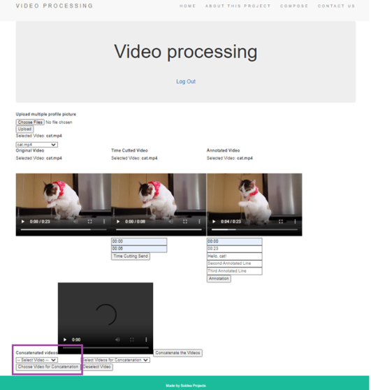

Video Processing

A specific number of video files will be uploaded to the server. Annotations or time cutting can be processed for every uploaded video file.  A specific number of videos files can be concatenated. FFMPEG multimedia framework was used to perform the video processing tasks.

Tools: HTML, Cascading Style Sheets (CSS), JavaScript, Node.js, Express Node.js, and MongoDB.

How to Use the Project
Steps to perform:
1.	Upload a specific number of videos
  
2.	Select a video that you want to perform time cutting and/or annotations.
  
3.	Select the order of concatenation for the videos
  
4.	Unselect the order of concatenation for the videos
  
5.	Concatenate the videos
  
